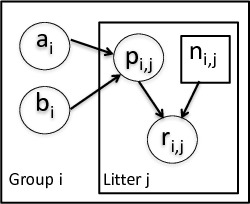

```{r chunksetup, include=FALSE} 
# include any code here you don't want to show up in the document,
# e.g. package and dataset loading
library(methods)  # otherwise new() not being found 
library(nimble)
```


# The BUGS language

The BUGS language is described in detail in the NIMBLE manual and in the [relevant section of the BUGS manual](http://www.openbugs.net/Manuals/ModelSpecification.html). 

### Stochastic declarations

  - `x ~ dgamma(shape, scale)` (`x` follows a gamma distribution with parameters `shape` and `scale`)

### Deterministic declarations

  - `y <- 2 * x`

### For loops

```
for(i in 1:10) {
   lambda[i] <- exp(mu[i])
   y[i] ~ dpois(lambda[i])
}
```

# Classic BUGS examples

There are lots of example models originally provided by the BUGS project:

  - Included in NIMBLE (*classic-bugs* directory) or found here on the [JAGS website](https://sourceforge.net/projects/mcmc-jags/files/Examples/).
  - Information provided here: [Volume 1](http://www.mrc-bsu.cam.ac.uk/wp-content/uploads/WinBUGS_Vol1.pdf), [Volume 2](http://www.mrc-bsu.cam.ac.uk/wp-content/uploads/WinBUGS_Vol2.pdf), and [Volume 3](http://www.mrc-bsu.cam.ac.uk/wp-content/uploads/WinBUGS_Vol3.pdf) of the WinBUGS example manuals.

We'll see a variety of example models this afternoon.

# NIMBLE's dialect of BUGS

   - The BUGS syntax used in NIMBLE has minor differences from that used in WinBUGS, OpenBUGS and/or JAGS. We'll see some of this as we go along, in particular in the [module on NIMBLE's dialect of BUGS](3.1_nimble_bugs_slides.html).
   - Also described in Section 5 of the [NIMBLE Users Manual](https://r-nimble.org/manuals/NimbleUserManual.pdf) and in this [blog post](https://r-nimble.org/quick-guide-for-converting-from-jags-or-bugs-to-nimble).

# A basic example

We'll use the *litters* model example from the original BUGS examples, available with NIMBLE in the *classic-bugs/vol1/litters* directory of the installed package (call ```searchpaths()``` after loading the NIMBLE package to find where this directory is). The data set describes the survival rates of rat pups in an experiment.

<center></center>

Here's the original litters model.

 - There are ```G=2``` groups of rat litters, with ```N=16```  litters (i.e., mothers) in each group, and a variable number of pups in each litter.
 - Survival of the pups in a litter is governed by a survival probability for each litter, ```p[i,j]```.
 - The probabilities for the litters within a group are considered to come from a common distribution, thereby borrowing strength across the litters in a group.
 - The common distributions are $p_{1,j} \sim \mbox{Beta(a_1, b_1)}$ for group 1 and $p_{2,j} \sim \mbox{Beta(a_2, b_2)}$ for group 2.

# Specifying the BUGS code for a model

Here we specify the litters model code directly in R. We can walk through some of details via the comments in the BUGS code.

```{r, model-code}
library(nimble)
littersCode <- nimbleCode({
  for (i in 1:G) {
     for (j in 1:N) {
     	# likelihood (data model)
        r[i,j] ~ dbin(p[i,j], n[i,j])
	# latent process (random effects)
        p[i,j] ~ dbeta(a[i], b[i]) 
     }
     # prior for hyperparameters
     # such gamma priors are not generally recommended, but
     # these are the priors from the original example
     a[i] ~ dgamma(1, .001)
     b[i] ~ dgamma(1, .001)
   }
})
```

# How NIMBLE is the same as BUGS and JAGS

* Most distributions and functions are supported

    - For distributions, see [User Manual Section 5.2.4](http://r-nimble.org/manuals/NimbleUserManual.pdf#page=39)
    - For functions, see  [User Manual Section 5.2.5](http://r-nimble.org/manuals/NimbleUserManual.pdf#page=44)
	
* Most syntax is supported

    - Truncation syntax is different when using `nimbleCode`.  (It can
      be the same as for JAGS if reading code from a file with `readBUGSmodel()`).

See our [guide online](https://r-nimble.org/quick-guide-for-converting-from-jags-or-bugs-to-nimble).

# How NIMBLE extends BUGS

  - Alternative distribution parameterizations (like R).
  - Named parameters (like R).
  - Vectorized math and linear algebra.
  - Definition-time if-then-else (multiple model variants from the same code).
  - User-defined functions and distributions.
  - Distinction between `constants` and `data`.

### How NIMBLE is limited compared to BUGS and/or JAGS:

   - NIMBLE is stricter about requiring square brackets and
   informative indices for non-scalar nodes.

# R-like alternative and named parameters

Note named parameters in distributions.

- BUGS/JAGS: Only `dnorm(mu, tau)` is supported, where `tau` is precision.
- NIMBLE: Alternative parameterizations and named parameters are supported:

    - `dnorm(mean = mu, sd = sigma)`
    - `dnorm(mean = mu, var = sigma_squared)`
    - `dnorm(mean = mu, tau = phi)` 
    
- Distributions with alternative parameterizations are listed in Table 5.2 of [User Manual Section 5.2.4](https://r-nimble.org/html_manual/cha-writing-models.html#subsec:dists-and-functions)

# Extensibility: new functions and distributions

We will cover this in depth later.

# More explicit need to provide dimensions (in models, not in nimbleFunctions)

- Square brackets must always be provided to indicate number of dimensions

    - If `x` is 2-dimensional, use `x[,] %*% beta[]`, not `x %*% beta`
    
* Sometimes NIMBLE is not as smart as BUGS/JAGS at determining dimensions.  There are two solutions:

    * Give dimensions explicitly: `x[1:n, 1:m]`, OR
    * Provide a `dimensions` argument to `nimbleModel`.  Example: `dimensions = list(x = c(n, m))`.

# Vectorized math and linear algebra

Instead of writing this in your model code:

```{r, vectorized-1}
nimbleOptions(verbose = FALSE)
m1 <- nimbleModel(
    nimbleCode({
        for(i in 1:5) {
            predicted[i] <- beta0 + beta1 * x[i]
        }
    })
)
```
you can write this:
```{r, vectorized-2}
m2 <- nimbleModel(
    nimbleCode({
        predicted[1:5] <- beta0 + beta1 * x[1:5]
    })
)
```

They are not equivalent:
```{r, vectorized-3}
## m1 has 5 scalar nodes
m1$getNodeNames()
## m2 has 1 vector node
m2$getNodeNames()
```

One is not necessarily better than the other.  It depends on the model
and the MCMC configuration.  (More on those topics later.)

Vectorized declarations do not work for distributions.

# Be careful about scalar vs. vector vs. matrix vs. array

This will not work:
```{r eval = FALSE}
x[1:5] <- A[1:5, 1:5] %*% b[1:5] + c[1:5]
```

The problem is that the right-hand-side returns a matrix, so we can't assign it to a vector.

This will work:
```{r eval = FALSE}
x[1:5] <- (A[1:5, 1:5] %*% b[1:5] + c[1:5])[,1]
```

# Definition-time if-then-else

If you wish to define multiple alternative models in one set of code,
you can use if-then-else statements.  These will be evaluated based on
variables in the R environment when the model is defined.  For
example:

```{r if-then-else}
code <- nimbleCode({
    sigma ~ dunif(0, 10)
    beta0 ~ dnorm(0, sd = 1000)
    beta1 ~ dnorm(0, sd = 1000)
    if(INCLUDE_X2) { beta2 ~ dnorm(0, sd = 1000) } else {}
    for(i in 1:10) {
        if(INCLUDE_X2) {
            y[i] ~ dnorm(beta0 + beta1 * x1[i] + beta2 * x2[i], sd = sigma)
        } else {
            y[i] ~ dnorm(beta0 + beta1 * x1[i], sd = sigma)
        }
    }
})

INCLUDE_X2 <- FALSE
m1 <- nimbleModel(code)
INCLUDE_X2 <- TRUE
m2 <- nimbleModel(code)
m1$getNodeNames()
m2$getNodeNames()

```

m2 has `beta2` while m1 does not.  The long names are "lifted nodes" -- more on those later.

